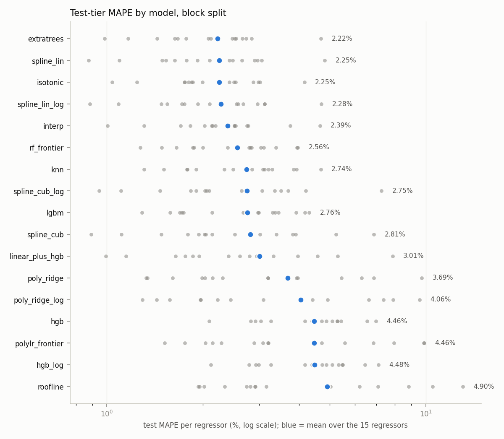
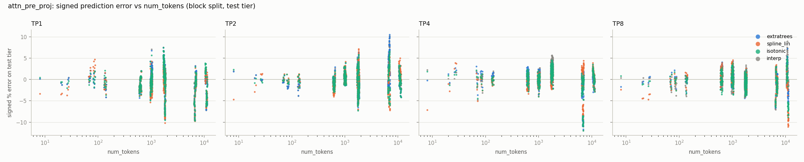
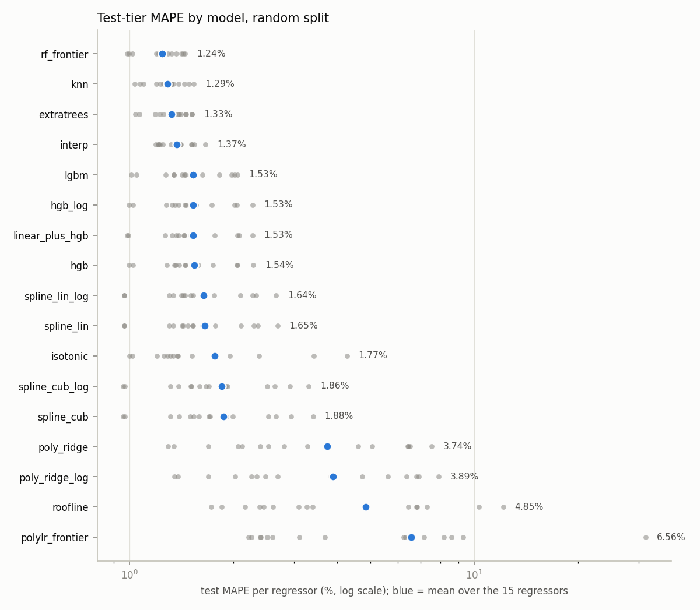

# Regressor benchmark: full_v1

Numbers are MAPE in percent on the ms-scale label unless stated. `wins` = regressors (op/TP) where the model has the lowest test MAPE. `CV dMAPE vs interp` = mean (model - interp) MAPE on identical folds, negative is better; `CV beats interp` = share of folds where the model is lower.

## Label noise floor

Relative standard error of the 25-sample median per regressor. A MAPE difference between two models that is smaller than this is not resolvable by this dataset.

| op | tp | label rel std % (median) | label rel SE % (median) | label rel SE % (p95) |
|---|---|---|---|---|
| attn_post_proj | 1 | 1.55 | 0.39 | 1.20 |
| attn_post_proj | 2 | 2.03 | 0.51 | 1.82 |
| attn_post_proj | 4 | 2.62 | 0.66 | 2.14 |
| attn_post_proj | 8 | 3.48 | 0.87 | 2.71 |
| attn_pre_proj | 1 | 1.10 | 0.27 | 0.74 |
| attn_pre_proj | 2 | 1.24 | 0.31 | 0.86 |
| attn_pre_proj | 4 | 1.49 | 0.37 | 1.01 |
| attn_pre_proj | 8 | 1.80 | 0.45 | 1.11 |
| attn_rope | 1 | 2.80 | 0.70 | 3.41 |
| attn_rope | 2 | 3.71 | 0.93 | 3.97 |
| attn_rope | 4 | 4.34 | 1.09 | 4.28 |
| attn_rope | 8 | 5.92 | 1.48 | 4.43 |
| emb | 1 | 10.38 | 1.84 | 2.93 |
| input_layernorm | 1 | 2.82 | 0.71 | 2.93 |
| post_attention_layernorm | 1 | 2.71 | 0.68 | 2.99 |

## Geometry: block

### Leaderboard (mean over the 15 regressors)

| model | family | test MAPE mean | test MAPE median | test MAPE worst | worst regressor | test p95 APE mean | test |bias| mean | CV MAPE mean | CV MAPE std | wins | fit s | CV dMAPE vs interp | CV beats interp |
|---|---|---|---|---|---|---|---|---|---|---|---|---|---|
| extratrees | trees | 2.22 | 2.12 | 4.69 | attn_post_proj/TP8 | 7.12 | 0.52 | 3.15 | 1.28 | 3 | 0.30 | -0.07 | 0.56 |
| spline_lin | spline | 2.25 | 2.10 | 4.82 | attn_post_proj/TP8 | 6.76 | 0.62 | 3.91 | 3.44 | 4 | 0.01 | 0.69 | 0.55 |
| isotonic | baseline | 2.25 | 1.99 | 4.16 | attn_post_proj/TP8 | 7.05 | 0.48 | 3.27 | 1.33 | 3 | 0.00 | 0.05 | 0.64 |
| spline_lin_log | spline | 2.28 | 2.10 | 4.70 | attn_post_proj/TP8 | 7.01 | 0.63 | 3.50 | 2.14 | 2 | 0.01 | 0.28 | 0.54 |
| interp | baseline | 2.39 | 2.19 | 4.66 | attn_post_proj/TP8 | 7.49 | 0.71 | 3.22 | 1.28 | 0 | 0.00 | 0.00 | 0.00 |
| rf_frontier | trees | 2.56 | 2.79 | 3.97 | attn_pre_proj/TP2 | 9.04 | 0.84 | 3.88 | 1.51 | 1 | 0.64 | 0.66 | 0.18 |
| knn | neighbours | 2.74 | 2.85 | 4.69 | attn_post_proj/TP8 | 9.15 | 1.04 | 3.87 | 1.46 | 0 | 0.00 | 0.65 | 0.16 |
| spline_cub_log | spline | 2.75 | 2.09 | 7.26 | attn_post_proj/TP8 | 8.60 | 0.97 | 3.96 | 2.84 | 0 | 0.00 | 0.74 | 0.48 |
| lgbm | boosting | 2.76 | 2.97 | 4.31 | attn_pre_proj/TP2 | 9.07 | 0.95 | 5.08 | 2.39 | 1 | 0.03 | 1.87 | 0.10 |
| spline_cub | spline | 2.81 | 2.14 | 6.88 | attn_post_proj/TP8 | 8.96 | 1.07 | 4.38 | 4.22 | 1 | 0.00 | 1.16 | 0.46 |
| linear_plus_hgb | hybrid | 3.01 | 2.61 | 7.87 | attn_post_proj/TP8 | 9.32 | 1.34 | 3.62 | 1.30 | 0 | 0.44 | 0.41 | 0.36 |
| poly_ridge | polynomial | 3.69 | 3.20 | 9.70 | attn_post_proj/TP8 | 10.22 | 0.80 | 4.65 | 2.12 | 0 | 0.00 | 1.43 | 0.26 |
| poly_ridge_log | polynomial | 4.06 | 3.09 | 9.54 | input_layernorm/TP1 | 11.16 | 0.73 | 5.26 | 3.10 | 0 | 0.00 | 2.04 | 0.22 |
| hgb | boosting | 4.46 | 4.72 | 6.98 | input_layernorm/TP1 | 15.43 | 1.81 | 5.37 | 2.12 | 0 | 0.49 | 2.15 | 0.05 |
| polylr_frontier | polynomial | 4.46 | 3.20 | 9.89 | input_layernorm/TP1 | 12.52 | 0.83 | 4.87 | 1.37 | 0 | 0.00 | 1.65 | 0.17 |
| hgb_log | boosting | 4.48 | 4.72 | 7.09 | input_layernorm/TP1 | 15.41 | 1.84 | 5.34 | 2.10 | 0 | 0.45 | 2.12 | 0.05 |
| roofline | physical | 4.90 | 2.92 | 13.04 | post_attention_layernorm/TP1 | 11.30 | 0.94 | 5.07 | 1.24 | 0 | 0.00 | 1.86 | 0.22 |

### Best model per regressor

| op | tp | best | best MAPE | best p95 | runner-up | runner-up MAPE | interp MAPE | rf_frontier MAPE |
|---|---|---|---|---|---|---|---|---|
| attn_post_proj | 1 | isotonic | 2.42 | 8.26 | extratrees | 2.48 | 2.51 | 2.84 |
| attn_post_proj | 2 | extratrees | 2.73 | 9.04 | interp | 2.75 | 2.75 | 2.82 |
| attn_post_proj | 4 | spline_lin | 2.48 | 7.75 | spline_lin_log | 2.58 | 3.76 | 3.39 |
| attn_post_proj | 8 | rf_frontier | 3.95 | 24.88 | isotonic | 4.16 | 4.66 | 3.95 |
| attn_pre_proj | 1 | spline_lin | 2.42 | 7.94 | interp | 2.53 | 2.53 | 3.11 |
| attn_pre_proj | 2 | isotonic | 1.99 | 5.08 | spline_cub | 2.02 | 2.13 | 3.97 |
| attn_pre_proj | 4 | spline_lin | 1.53 | 4.40 | spline_lin_log | 1.55 | 2.14 | 2.00 |
| attn_pre_proj | 8 | extratrees | 1.67 | 4.51 | interp | 1.70 | 1.70 | 1.86 |
| attn_rope | 1 | isotonic | 2.51 | 7.01 | interp | 2.51 | 2.51 | 2.79 |
| attn_rope | 2 | spline_lin_log | 1.75 | 4.49 | extratrees | 1.77 | 1.83 | 2.39 |
| attn_rope | 4 | spline_lin_log | 1.09 | 3.02 | spline_lin | 1.09 | 1.31 | 1.65 |
| attn_rope | 8 | spline_lin | 0.88 | 2.43 | spline_lin_log | 0.88 | 1.01 | 1.27 |
| emb | 1 | extratrees | 1.44 | 4.22 | spline_cub_log | 1.47 | 2.19 | 1.49 |
| input_layernorm | 1 | spline_cub | 2.52 | 7.99 | spline_cub_log | 2.64 | 2.78 | 3.04 |
| post_attention_layernorm | 1 | lgbm | 1.58 | 4.29 | spline_lin | 1.63 | 2.02 | 1.88 |

### MAPE by token regime (top 3 + baselines)

| model | 1-64 tok | 65-512 tok | 513-2048 tok | 2049-8192 tok | 8193-16384 tok |
|---|---|---|---|---|---|
| extratrees | 1.55 | 1.33 | 1.94 | 3.29 | 2.74 |
| spline_lin | 4.03 | 1.71 | 1.86 | 3.09 | 3.25 |
| isotonic | 2.35 | 1.46 | 1.94 | 3.10 | 3.12 |
| interp | 1.01 | 1.26 | 2.09 | 3.56 | 3.02 |

### Selected hyper-parameters (top 3)

| model | op | tp | best_params | cv_select_mape |
|---|---|---|---|---|
| extratrees | attn_post_proj | 1 | {"min_samples_leaf": 1} | 4.12 |
| extratrees | attn_post_proj | 2 | {"min_samples_leaf": 2} | 4.82 |
| extratrees | attn_post_proj | 4 | {"min_samples_leaf": 2} | 5.81 |
| extratrees | attn_post_proj | 8 | {"min_samples_leaf": 1} | 4.84 |
| extratrees | attn_pre_proj | 1 | {"min_samples_leaf": 1} | 3.23 |
| extratrees | attn_pre_proj | 2 | {"min_samples_leaf": 1} | 2.57 |
| extratrees | attn_pre_proj | 4 | {"min_samples_leaf": 2} | 2.15 |
| extratrees | attn_pre_proj | 8 | {"min_samples_leaf": 2} | 1.72 |
| extratrees | attn_rope | 1 | {"min_samples_leaf": 1} | 2.33 |
| extratrees | attn_rope | 2 | {"min_samples_leaf": 2} | 2.01 |
| extratrees | attn_rope | 4 | {"min_samples_leaf": 2} | 1.28 |
| extratrees | attn_rope | 8 | {"min_samples_leaf": 2} | 1.33 |
| extratrees | emb | 1 | {"min_samples_leaf": 2} | 1.69 |
| extratrees | input_layernorm | 1 | {"min_samples_leaf": 1} | 3.21 |
| extratrees | post_attention_layernorm | 1 | {"min_samples_leaf": 1} | 3.62 |
| isotonic | attn_post_proj | 1 | {} | nan |
| isotonic | attn_post_proj | 2 | {} | nan |
| isotonic | attn_post_proj | 4 | {} | nan |
| isotonic | attn_post_proj | 8 | {} | nan |
| isotonic | attn_pre_proj | 1 | {} | nan |
| isotonic | attn_pre_proj | 2 | {} | nan |
| isotonic | attn_pre_proj | 4 | {} | nan |
| isotonic | attn_pre_proj | 8 | {} | nan |
| isotonic | attn_rope | 1 | {} | nan |
| isotonic | attn_rope | 2 | {} | nan |
| isotonic | attn_rope | 4 | {} | nan |
| isotonic | attn_rope | 8 | {} | nan |
| isotonic | emb | 1 | {} | nan |
| isotonic | input_layernorm | 1 | {} | nan |
| isotonic | post_attention_layernorm | 1 | {} | nan |
| spline_lin | attn_post_proj | 1 | {"splinetransformer__n_knots": 64} | 4.44 |
| spline_lin | attn_post_proj | 2 | {"splinetransformer__n_knots": 64} | 4.55 |
| spline_lin | attn_post_proj | 4 | {"splinetransformer__n_knots": 128} | 6.43 |
| spline_lin | attn_post_proj | 8 | {"splinetransformer__n_knots": 128} | 5.49 |
| spline_lin | attn_pre_proj | 1 | {"splinetransformer__n_knots": 64} | 3.41 |
| spline_lin | attn_pre_proj | 2 | {"splinetransformer__n_knots": 128} | 2.54 |
| spline_lin | attn_pre_proj | 4 | {"splinetransformer__n_knots": 128} | 2.00 |
| spline_lin | attn_pre_proj | 8 | {"splinetransformer__n_knots": 32} | 1.76 |
| spline_lin | attn_rope | 1 | {"splinetransformer__n_knots": 8} | 2.01 |
| spline_lin | attn_rope | 2 | {"splinetransformer__n_knots": 64} | 1.75 |
| spline_lin | attn_rope | 4 | {"splinetransformer__n_knots": 64} | 1.09 |
| spline_lin | attn_rope | 8 | {"splinetransformer__n_knots": 64} | 1.10 |
| spline_lin | emb | 1 | {"splinetransformer__n_knots": 64} | 1.63 |
| spline_lin | input_layernorm | 1 | {"splinetransformer__n_knots": 128} | 3.29 |
| spline_lin | post_attention_layernorm | 1 | {"splinetransformer__n_knots": 128} | 3.13 |

## Geometry: random

### Leaderboard (mean over the 15 regressors)

| model | family | test MAPE mean | test MAPE median | test MAPE worst | worst regressor | test p95 APE mean | test |bias| mean | CV MAPE mean | CV MAPE std | wins | fit s | CV dMAPE vs interp | CV beats interp |
|---|---|---|---|---|---|---|---|---|---|---|---|---|---|
| rf_frontier | trees | 1.24 | 1.26 | 1.45 | attn_post_proj/TP1 | 3.06 | 0.09 | 1.28 | 0.06 | 7 | 0.82 | -0.14 | 0.91 |
| knn | neighbours | 1.29 | 1.32 | 1.54 | emb/TP1 | 3.20 | 0.09 | 1.33 | 0.06 | 2 | 0.00 | -0.09 | 0.84 |
| extratrees | trees | 1.33 | 1.35 | 1.52 | attn_post_proj/TP8 | 3.37 | 0.15 | 1.38 | 0.06 | 1 | 0.36 | -0.04 | 0.61 |
| interp | baseline | 1.37 | 1.38 | 1.66 | emb/TP1 | 3.45 | 0.10 | 1.42 | 0.06 | 1 | 0.00 | 0.00 | 0.00 |
| lgbm | boosting | 1.53 | 1.46 | 2.06 | attn_post_proj/TP2 | 4.11 | 0.12 | 1.48 | 0.09 | 0 | 0.05 | 0.06 | 0.50 |
| hgb_log | boosting | 1.53 | 1.46 | 2.27 | attn_post_proj/TP8 | 4.18 | 0.12 | 1.49 | 0.09 | 0 | 0.58 | 0.06 | 0.48 |
| linear_plus_hgb | hybrid | 1.53 | 1.44 | 2.28 | attn_post_proj/TP8 | 4.15 | 0.17 | 1.47 | 0.09 | 0 | 0.48 | 0.05 | 0.53 |
| hgb | boosting | 1.54 | 1.46 | 2.29 | attn_post_proj/TP8 | 4.19 | 0.14 | 1.49 | 0.09 | 0 | 0.85 | 0.07 | 0.50 |
| spline_lin_log | spline | 1.64 | 1.50 | 2.66 | attn_post_proj/TP8 | 5.00 | 0.13 | 1.61 | 0.08 | 1 | 0.01 | 0.18 | 0.41 |
| spline_lin | spline | 1.65 | 1.53 | 2.69 | attn_post_proj/TP8 | 4.97 | 0.15 | 1.61 | 0.08 | 0 | 0.01 | 0.19 | 0.41 |
| isotonic | baseline | 1.77 | 1.38 | 4.27 | attn_post_proj/TP8 | 5.34 | 0.14 | 1.76 | 0.08 | 2 | 0.00 | 0.34 | 0.49 |
| spline_cub_log | spline | 1.86 | 1.67 | 3.32 | attn_post_proj/TP8 | 5.57 | 0.14 | 1.84 | 0.09 | 0 | 0.01 | 0.42 | 0.34 |
| spline_cub | spline | 1.88 | 1.70 | 3.41 | attn_post_proj/TP8 | 5.66 | 0.16 | 1.86 | 0.10 | 1 | 0.00 | 0.44 | 0.34 |
| poly_ridge | polynomial | 3.74 | 2.81 | 7.53 | attn_post_proj/TP8 | 10.53 | 0.41 | 3.69 | 0.14 | 0 | 0.00 | 2.27 | 0.02 |
| poly_ridge_log | polynomial | 3.89 | 2.69 | 7.89 | input_layernorm/TP1 | 10.36 | 0.27 | 3.80 | 0.13 | 0 | 0.00 | 2.38 | 0.02 |
| roofline | physical | 4.85 | 3.27 | 12.14 | post_attention_layernorm/TP1 | 11.99 | 0.56 | 4.74 | 0.16 | 0 | 0.00 | 3.32 | 0.00 |
| polylr_frontier | polynomial | 6.56 | 3.69 | 31.44 | attn_rope/TP8 | 17.63 | 1.79 | 4.47 | 0.17 | 0 | 0.00 | 3.05 | 0.00 |

### Best model per regressor

| op | tp | best | best MAPE | best p95 | runner-up | runner-up MAPE | interp MAPE | rf_frontier MAPE |
|---|---|---|---|---|---|---|---|---|
| attn_post_proj | 1 | interp | 1.38 | 3.67 | extratrees | 1.38 | 1.38 | 1.45 |
| attn_post_proj | 2 | rf_frontier | 1.43 | 3.53 | knn | 1.49 | 1.51 | 1.43 |
| attn_post_proj | 4 | knn | 1.23 | 3.14 | interp | 1.25 | 1.25 | 1.26 |
| attn_post_proj | 8 | rf_frontier | 1.37 | 3.77 | knn | 1.44 | 1.52 | 1.37 |
| attn_pre_proj | 1 | knn | 1.32 | 2.87 | rf_frontier | 1.33 | 1.35 | 1.33 |
| attn_pre_proj | 2 | extratrees | 1.19 | 2.85 | interp | 1.19 | 1.19 | 1.26 |
| attn_pre_proj | 4 | rf_frontier | 1.20 | 2.56 | knn | 1.27 | 1.32 | 1.20 |
| attn_pre_proj | 8 | rf_frontier | 1.22 | 2.71 | extratrees | 1.31 | 1.40 | 1.22 |
| attn_rope | 1 | rf_frontier | 1.23 | 3.04 | knn | 1.25 | 1.54 | 1.23 |
| attn_rope | 2 | isotonic | 1.29 | 2.99 | rf_frontier | 1.29 | 1.39 | 1.29 |
| attn_rope | 4 | spline_lin_log | 0.97 | 2.43 | spline_lin | 0.97 | 1.21 | 1.02 |
| attn_rope | 8 | spline_cub | 0.96 | 2.98 | spline_cub_log | 0.96 | 1.23 | 0.99 |
| emb | 1 | isotonic | 1.38 | 3.88 | rf_frontier | 1.41 | 1.66 | 1.41 |
| input_layernorm | 1 | rf_frontier | 1.22 | 2.87 | knn | 1.32 | 1.41 | 1.22 |
| post_attention_layernorm | 1 | rf_frontier | 1.00 | 2.68 | knn | 1.10 | 1.21 | 1.00 |

### MAPE by token regime (top 3 + baselines)

| model | 1-64 tok | 65-512 tok | 513-2048 tok | 2049-8192 tok | 8193-16384 tok |
|---|---|---|---|---|---|
| rf_frontier | 3.72 | 1.19 | 1.12 | 1.31 | 1.22 |
| knn | 4.03 | 1.27 | 1.15 | 1.35 | 1.23 |
| extratrees | 3.57 | 1.36 | 1.22 | 1.37 | 1.25 |
| interp | 3.22 | 1.38 | 1.28 | 1.44 | 1.30 |
| isotonic | 3.98 | 1.25 | 1.33 | 2.25 | 2.49 |

### Selected hyper-parameters (top 3)

| model | op | tp | best_params | cv_select_mape |
|---|---|---|---|---|
| extratrees | attn_post_proj | 1 | {"min_samples_leaf": 1} | 1.55 |
| extratrees | attn_post_proj | 2 | {"min_samples_leaf": 1} | 1.54 |
| extratrees | attn_post_proj | 4 | {"min_samples_leaf": 1} | 1.56 |
| extratrees | attn_post_proj | 8 | {"min_samples_leaf": 1} | 1.66 |
| extratrees | attn_pre_proj | 1 | {"min_samples_leaf": 1} | 1.36 |
| extratrees | attn_pre_proj | 2 | {"min_samples_leaf": 1} | 1.13 |
| extratrees | attn_pre_proj | 4 | {"min_samples_leaf": 1} | 1.19 |
| extratrees | attn_pre_proj | 8 | {"min_samples_leaf": 2} | 1.22 |
| extratrees | attn_rope | 1 | {"min_samples_leaf": 2} | 1.59 |
| extratrees | attn_rope | 2 | {"min_samples_leaf": 1} | 1.42 |
| extratrees | attn_rope | 4 | {"min_samples_leaf": 2} | 1.12 |
| extratrees | attn_rope | 8 | {"min_samples_leaf": 2} | 1.03 |
| extratrees | emb | 1 | {"min_samples_leaf": 2} | 1.53 |
| extratrees | input_layernorm | 1 | {"min_samples_leaf": 1} | 1.56 |
| extratrees | post_attention_layernorm | 1 | {"min_samples_leaf": 1} | 1.46 |
| knn | attn_post_proj | 1 | {"n_neighbors": 3, "weights": "distance"} | 1.53 |
| knn | attn_post_proj | 2 | {"n_neighbors": 3, "weights": "distance"} | 1.54 |
| knn | attn_post_proj | 4 | {"n_neighbors": 3, "weights": "distance"} | 1.59 |
| knn | attn_post_proj | 8 | {"n_neighbors": 3, "weights": "distance"} | 1.63 |
| knn | attn_pre_proj | 1 | {"n_neighbors": 8, "weights": "distance"} | 1.30 |
| knn | attn_pre_proj | 2 | {"n_neighbors": 3, "weights": "distance"} | 1.12 |
| knn | attn_pre_proj | 4 | {"n_neighbors": 8, "weights": "distance"} | 1.12 |
| knn | attn_pre_proj | 8 | {"n_neighbors": 8, "weights": "distance"} | 1.19 |
| knn | attn_rope | 1 | {"n_neighbors": 8, "weights": "uniform"} | 1.39 |
| knn | attn_rope | 2 | {"n_neighbors": 8, "weights": "distance"} | 1.37 |
| knn | attn_rope | 4 | {"n_neighbors": 8, "weights": "uniform"} | 1.05 |
| knn | attn_rope | 8 | {"n_neighbors": 8, "weights": "uniform"} | 1.03 |
| knn | emb | 1 | {"n_neighbors": 8, "weights": "distance"} | 1.57 |
| knn | input_layernorm | 1 | {"n_neighbors": 8, "weights": "distance"} | 1.45 |
| knn | post_attention_layernorm | 1 | {"n_neighbors": 8, "weights": "distance"} | 1.32 |
| rf_frontier | attn_post_proj | 1 | {"max_depth": 8, "min_samples_split": 2, "n_estimators": 750} | 1.50 |
| rf_frontier | attn_post_proj | 2 | {"max_depth": 8, "min_samples_split": 2, "n_estimators": 500} | 1.48 |
| rf_frontier | attn_post_proj | 4 | {"max_depth": 16, "min_samples_split": 2, "n_estimators": 750} | 1.60 |
| rf_frontier | attn_post_proj | 8 | {"max_depth": 16, "min_samples_split": 5, "n_estimators": 750} | 1.59 |
| rf_frontier | attn_pre_proj | 1 | {"max_depth": 8, "min_samples_split": 5, "n_estimators": 250} | 1.27 |
| rf_frontier | attn_pre_proj | 2 | {"max_depth": 8, "min_samples_split": 5, "n_estimators": 250} | 1.11 |
| rf_frontier | attn_pre_proj | 4 | {"max_depth": 8, "min_samples_split": 5, "n_estimators": 500} | 1.07 |
| rf_frontier | attn_pre_proj | 8 | {"max_depth": 8, "min_samples_split": 10, "n_estimators": 500} | 1.13 |
| rf_frontier | attn_rope | 1 | {"max_depth": 8, "min_samples_split": 10, "n_estimators": 750} | 1.35 |
| rf_frontier | attn_rope | 2 | {"max_depth": 8, "min_samples_split": 10, "n_estimators": 750} | 1.35 |
| rf_frontier | attn_rope | 4 | {"max_depth": 8, "min_samples_split": 10, "n_estimators": 500} | 1.04 |
| rf_frontier | attn_rope | 8 | {"max_depth": 8, "min_samples_split": 10, "n_estimators": 250} | 0.98 |
| rf_frontier | emb | 1 | {"max_depth": 8, "min_samples_split": 2, "n_estimators": 500} | 1.47 |
| rf_frontier | input_layernorm | 1 | {"max_depth": 8, "min_samples_split": 10, "n_estimators": 500} | 1.32 |
| rf_frontier | post_attention_layernorm | 1 | {"max_depth": 8, "min_samples_split": 5, "n_estimators": 250} | 1.23 |

